# SME-Visualization

<h2> Visualization of (Pima) Diabetes DataSet</h2>

DataSource - <a href="https://github.com/shailendrakanshana/SME-Visualization/blob/main/Pima_DPP/diabetes.csv"> Diabetes DataSet</a>

<h3> Open code in Google Colab </h3>

 
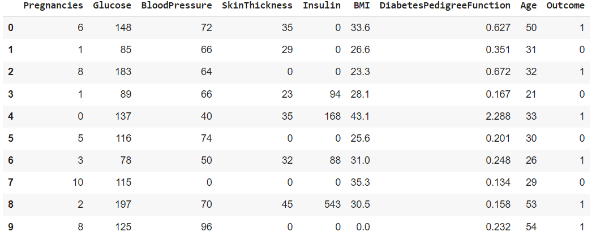 

<h2> Visualization of Titanic DataSet</h2>

DataSource - <a href="https://github.com/mwaskom/seaborn-data/blob/master/titanic.csv"> Titanic DataSet</a>

<h3> Open code in Google Colab </h3>

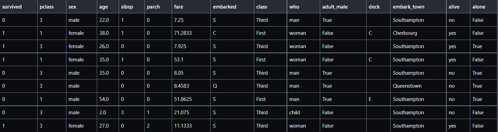 
<h3>Histogram representation of age</h3>

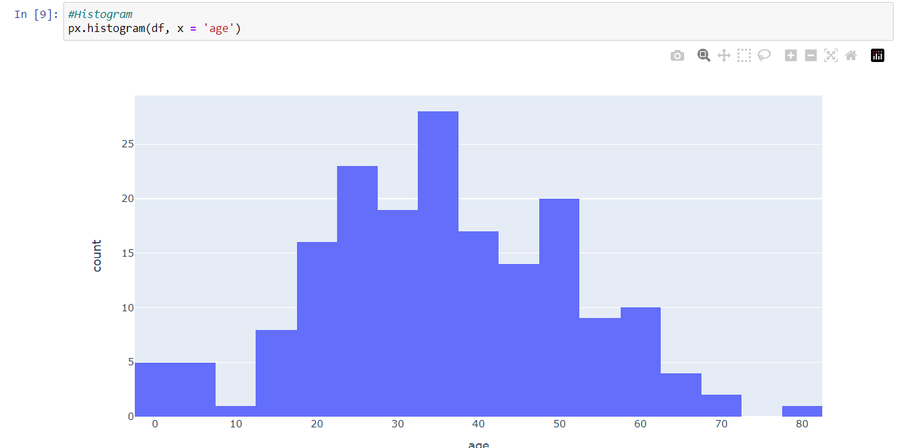
<h3>Boxplot representation of age</h3>
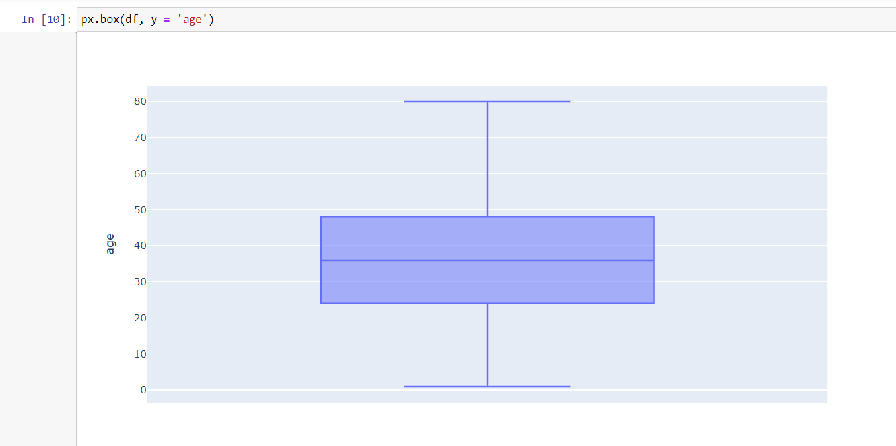
<h3>Histogram representation of fare</h3>
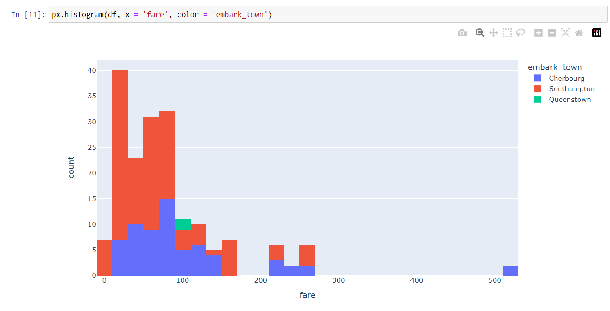
<h3>Piechart representation of fare</h3>
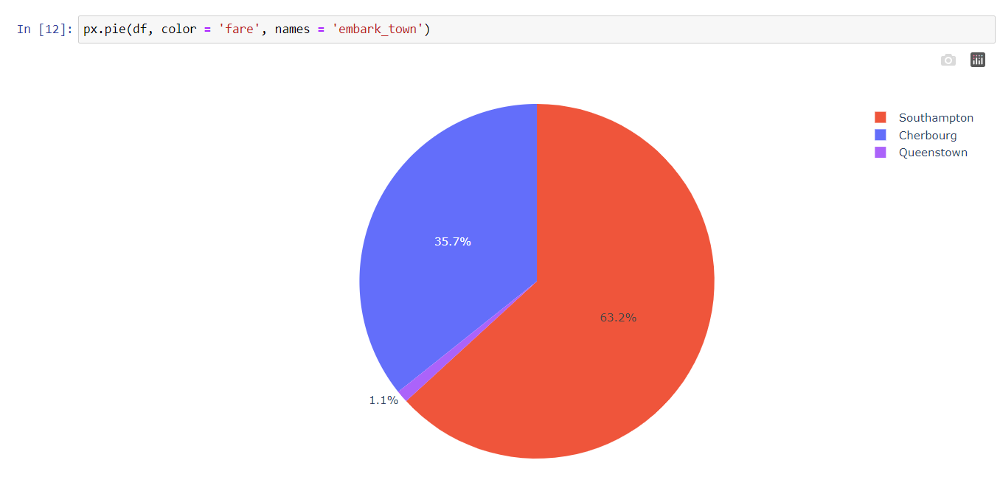
<h3>Boxplot representation of sex</h3>
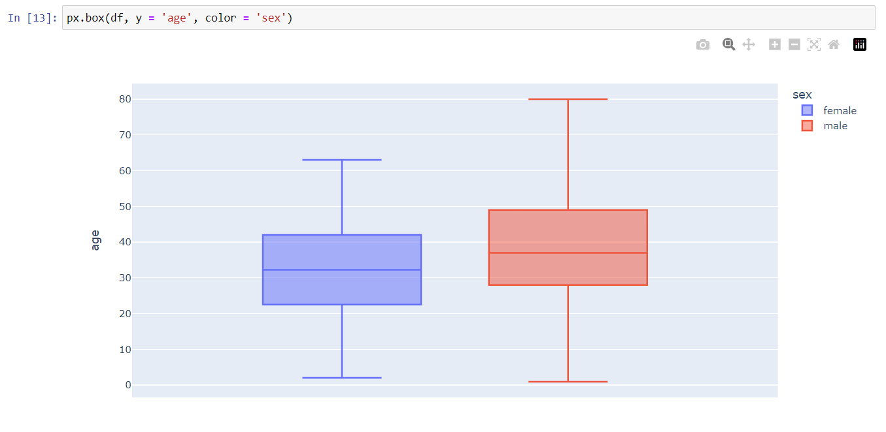
<h3>Histogram representation of normalized percent of sex</h3>
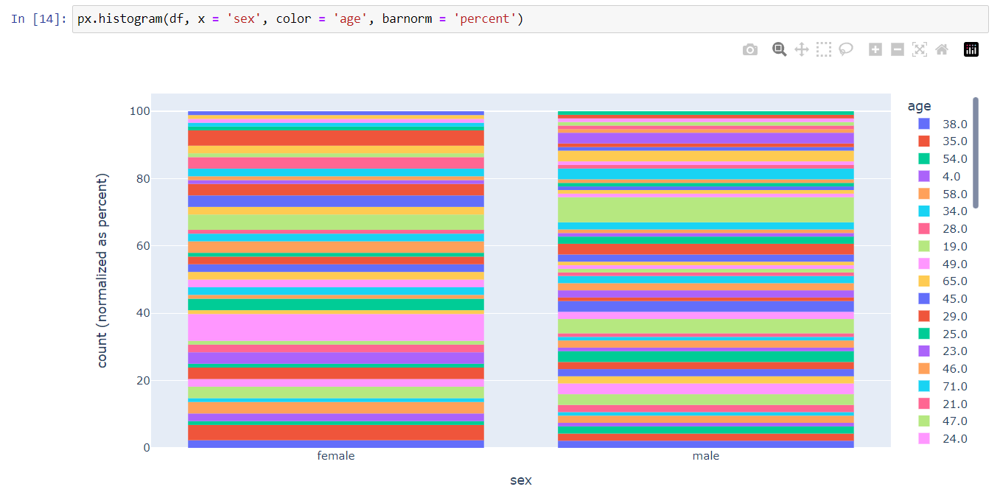
<h3>Histogram representation of nomalized percent and group of sex</h3>
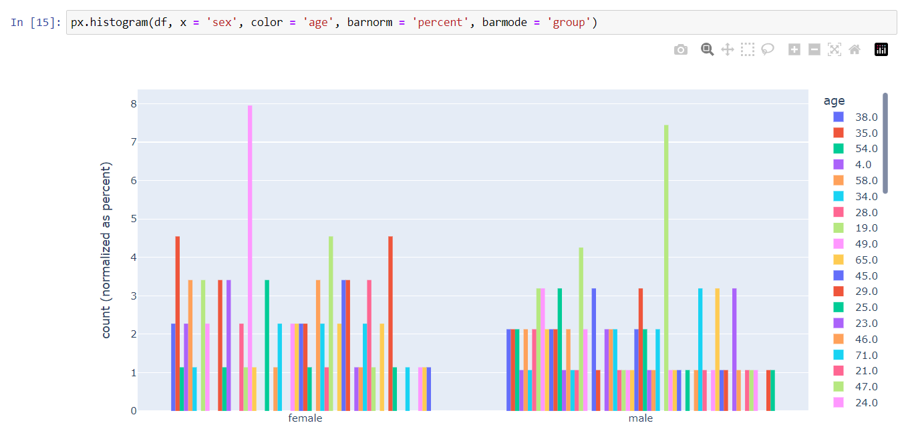
<h3>Scatterplot representaiton of people survived</h3>
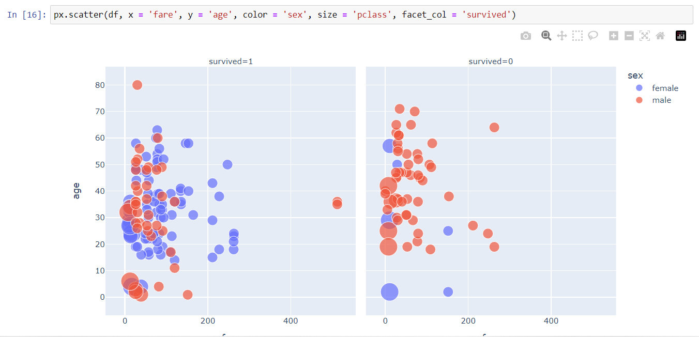
<h3>Scatterplot 3d representation of people survived<h3>
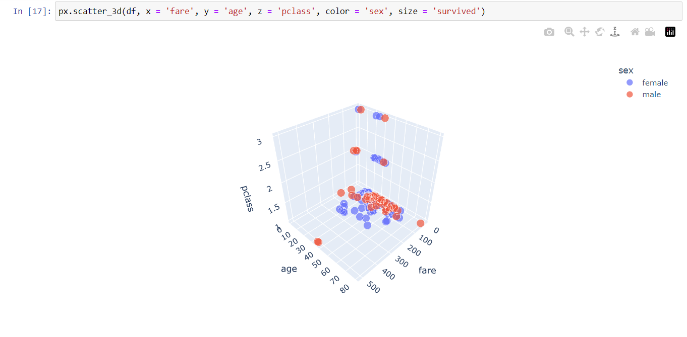
<h3>Scatterplot martix representation of fare,pclass,age and people survived</h3>
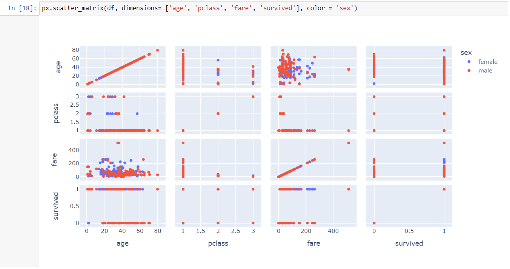

