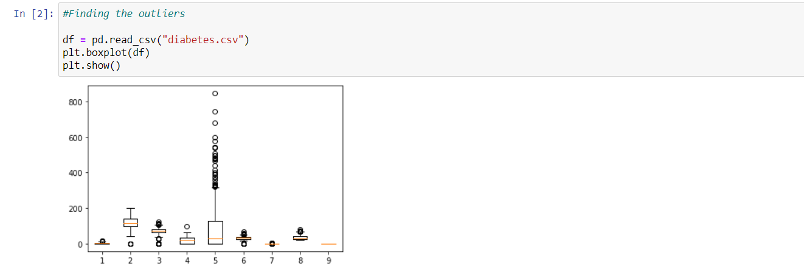
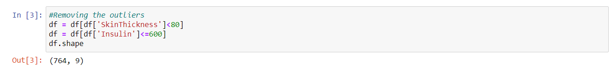
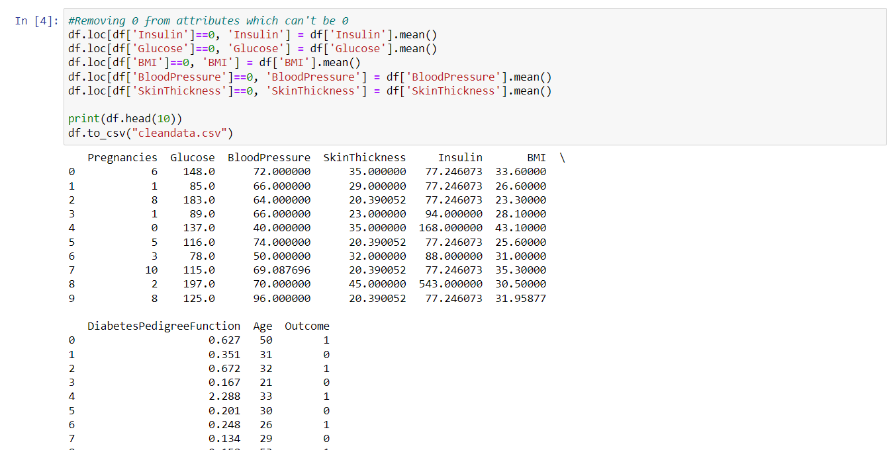
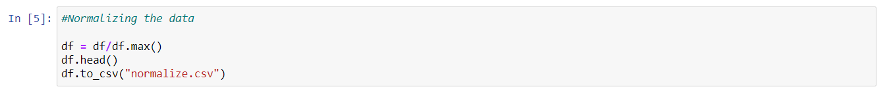
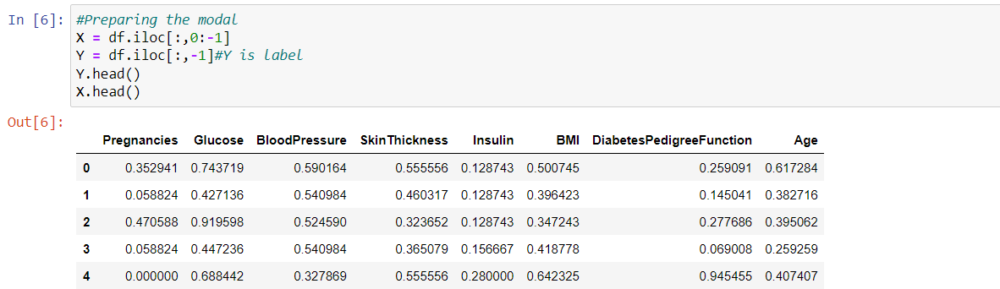
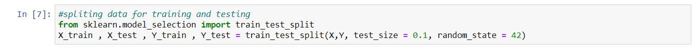
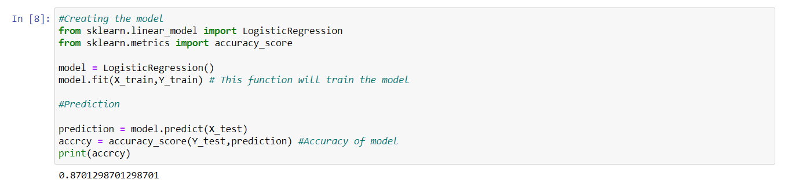

# SME-Visualization

<h2> Visualization of (Pima) Diabetes DataSet</h2>

DataSource - <a href="https://github.com/shailendrakanshana/SME-Visualization/blob/main/Pima_DPP/diabetes.csv"> Diabetes DataSet</a>

<h3> Open code in Google Colab </h3>

 

<h3>Finding the Outliers</h3>

<h3>Removing outliers</h3>

<h3>Removing zeros from attributes which can't be zero</h3>

<h3>Normalizing the data</h3>

<h3>Preparing the model</h3>

<h3>Spliting the data for training and testing</h3>

<h3>Creating the model</h3>

